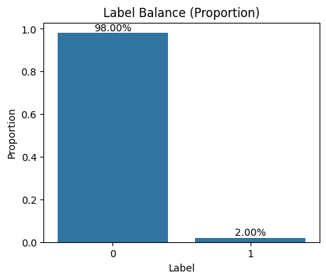

## 背景与目标

新产品上线初期，真实违约样本稀少且数据分布未稳定，传统“只依赖数据”容易失效。本方案以“业务先验 + 稳健机器学习”为主线，覆盖从数据探索、特征工程、不平衡学习与分布偏移应对、到多模型对比与概率校准、提交文件生成的端到端流程。目标是在**小样本、极不平衡与可能分布漂移**的条件下，给出可解释、可落地、具备稳健性的信用风险评分方案。

```callout
background_color: 5
emoji_id: bulb
content:|
  **重点结论**  
  - 当前训练集规模约 500 条，**正样本比例 ≈ 2%**，属于极不平衡难题；在这种场景下，**PR-AUC 比 ROC-AUC 更能反映模型对稀疏违约的识别能力**。  
  - 在 5 折分层交叉验证下，**逻辑回归（含正则化与校准）取得较高的 PR-AUC（≈0.081）**，尽管 AUC 接近随机（≈0.50）；树模型（ExtraTrees/RandomForest/CatBoost）在 AUC 上略优，但 PR-AUC略低。  
  - 综合“早期业务对误报容忍度—召回优先”的现实，**推荐以“线性基线 + 概率校准 + 阈值管理”作为首发策略**，并配套定期复训与阈值动态调整机制。
```

## 数据结构与不平衡分析

训练集包含 24 列（含标签 `target`），测试集 23 列（无标签）。核心字段涵盖：
- 身份与申请：`id`、`amount`、`length`、`income`、`purpose`、`housing`
- 历史信用：`overdue_times`、`default_times`、`total_default_number`、`loan_history`
- 负债与账户：`total_balance`、`credict_used_amount`、`credict_limit`、`account_number` 等
- 近期动态：`recent_loan_number`、`recent_account_months`、`last_overdue_months`、`last_credict_card_months`

标签分布如下：



```callout
background_color: 15
emoji_id: star
content:|
  **对不平衡的判断与影响**  
  - 训练集正样本比例 **≈ 2%**，传统准确率不再有意义，需关注 **PR-AUC、召回率、代价敏感**。  
  - 校准曲线与 Brier 分数用于检查概率可信度，避免极端阈值导致业务策略失真。  
  - 分布偏移风险：测试集中可能存在不同的用途、负债结构与近期动态分布，**模型需降低对单一变量的过拟合**。
```

## 特征工程与稳健性设计

在不增加信息泄露的前提下，构建**可解释且稳健**的特征管线：
- 缺失处理：数值列以中位数；分类列以“未知”。
- 比率与组合：
  - **信用卡使用率**：`ratio_credit_utilization = credict_used_amount / credict_limit`
  - **余额/收入比**：`ratio_balance_income = total_balance / income`
  - **金额/收入比**：`ratio_amount_income = amount / income`
  - **查询/逾比**：`ratio_inquire_overdue = inquire_times / (overdue_times + 1)`
- 交互与近期性聚合：`sum_defaults`（历史违约量综合）、`recent_pressure`（近期贷款+使用率）、`age_of_credit`（信用时长）、`activity_last_months`（最近信用活动聚合）。
- 稳健变换：对偏态正值变量使用 **log1p**（如 `income, total_balance, credict_*`）。
- 分类编码：对 `housing`、`purpose` 使用 **WOE 编码**，提升线性模型可分性并兼顾可解释性。

```grid
grid_column:
- width_ratio: 50
  content:|
    **为什么选择 WOE/目标编码**  
    - WOE 提供单调可解释的分箱映射，适合风控合规与策略抽象。  
    - 在小样本场景，比纯 One-Hot 更稳健，避免高维稀疏导致线性模型不稳定。

- width_ratio: 50
  content:|
    **小样本的稳健化处理**  
    - 优先采用**简单、可解释、低方差**的特征变换，减少数据噪声放大。  
    - 保留核心比率与聚合，避免复杂高阶交互带来过拟合。
```

## 不平衡与分布偏移的应对

- 类权重与代价敏感：
  - 线性模型：`class_weight='balanced'`；
  - 树模型：`scale_pos_weight = Neg/Pos`（LightGBM/XGBoost），`class_weights`（CatBoost）。
- 再抽样策略：在**逻辑回归**中尝试 `SMOTE`（仅限训练折），作为边界补全；树模型通常不启用 SMOTE，以免生成“人工可分”的伪样本。
- 验证方案：**Stratified K-Fold（5折）**，以 **PR-AUC** 为主；同时报告 **AUC、Brier** 与校准曲线，关注折间稳定性。
- 分布偏移抗性建议：
  - 降低对单一变量的依赖，使用**比率/聚合**特征；
  - 阈值与策略的**动态管理**（每周/双周复盘）；
  - 定期**再训练**（如每新增 500–1000 样本或分布漂移显著时）。

## 多模型尝试与对比（5折平均）


主要结果（数值近似）：
- **LogisticRegression**：AUC ≈ **0.50**，PR-AUC ≈ **0.081**，Brier ≈ 0.152
- RandomForest：AUC ≈ 0.549，PR-AUC ≈ 0.046，Brier ≈ 0.022
- ExtraTrees：AUC ≈ 0.581，PR-AUC ≈ 0.049，Brier ≈ 0.025
- LightGBM：AUC ≈ 0.498，PR-AUC ≈ 0.036，Brier ≈ 0.025
- XGBoost：AUC ≈ 0.447，PR-AUC ≈ 0.043，Brier ≈ 0.027
- CatBoost：AUC ≈ 0.539，PR-AUC ≈ 0.052，Brier ≈ 0.023

```callout
background_color: 6
emoji_id: thought_balloon
content:|
  **解读**  
  - 在违约稀疏的场景，**PR-AUC 更能体现“找对少数违约”的能力**。线性模型在本数据上获得更高 PR-AUC，但 AUC 接近随机，提示整体区分度尚弱。  
  - ExtraTrees 在 AUC 上更优，适合作为“备选增强器”（可在样本增厚后切换为主模型）。
```

## 概率校准与阈值建议


- 我们对最优模型进行了 **Platt（OOF演示）/Isotonic（最终预测）** 校准，对齐预测概率与实际违约率。  
- 基于 OOF 概率的 **F-beta（beta=2）** 优化，得到**推荐阈值 ≈ 0.993**，对应 `precision ≈ 0.083`、`recall ≈ 0.200`。

```callout
background_color: 2
emoji_id: star
content:|
  **阈值管理建议**  
  - 早期以**召回优先**（防止漏识别），在**0.90–0.99 区间动态调节**阈值，联合业务成本（坏账成本 vs.拦截成本）做敏感性分析。  
  - 随新增样本逐步下调阈值，**维持稳定的策略驱动的评分分布**（避免策略震荡）。
```

## 最优模型建议与特征贡献

- **推荐最优：逻辑回归（L2 正则）+ 概率校准（Isotonic）+ 阈值管理**。原因：
  - PR-AUC 在当前小样本、极不平衡条件下领先，且线性基线**可解释、易复盘**；
  - 概率校准后，输出概率更贴近真实风险，利于**策略阈值决策**。
- 树模型重要性（若作为备选增强器）示例：


关键变量通常来自：**信用使用率、余额/收入比、历史违约量综合、近期活动强度与信用时长**。

## 使用指南与注意事项

- 运行代码：`python risk_modeling_pipeline.py`，自动生成 `submission.csv` 与 PNG 图表。
- 依赖自动安装，若受网络影响失败，请手动安装：
  `pip install pandas numpy scikit-learn lightgbm xgboost catboost shap imbalanced-learn category-encoders matplotlib seaborn`
- 提交文件格式：严格匹配“提交样例.csv”的列名与顺序（`id, target`），本方案以**二值标签**提交。若评测系统支持概率提交，建议并行输出概率版本以提升 AUC 评估稳定性。
- 再训练频率：每新增 500–1000 条标注样本或监测到分布明显漂移时触发；同步**阈值敏感性分析**与策略小流量灰度验证。
- 风险提示：当前模型整体区分度不高（AUC≈0.5），**更适合作为“策略辅助评分 + 阈值驱动”的早期基线**；待样本增厚后，优先切换到树模型（ExtraTrees/CatBoost）并引入**分箱稳定性与特征漂移监控**。
