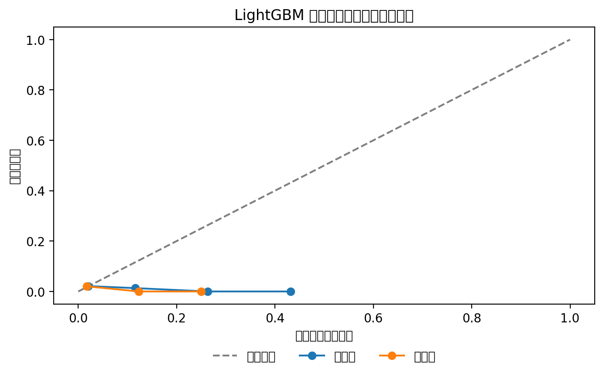
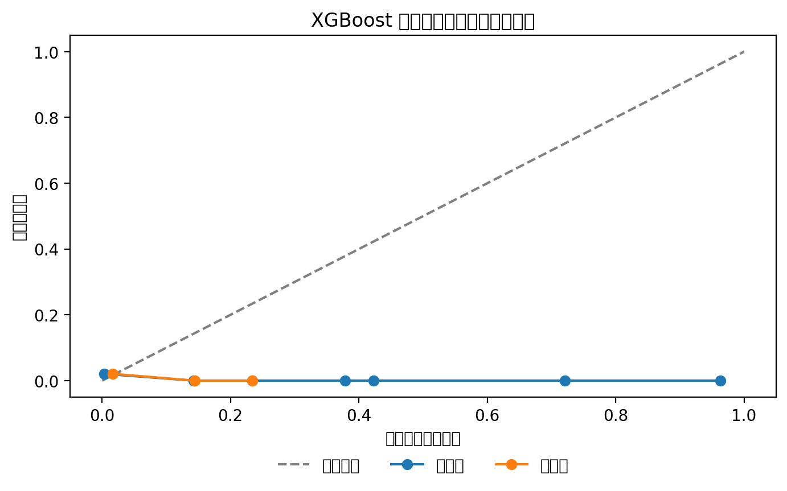
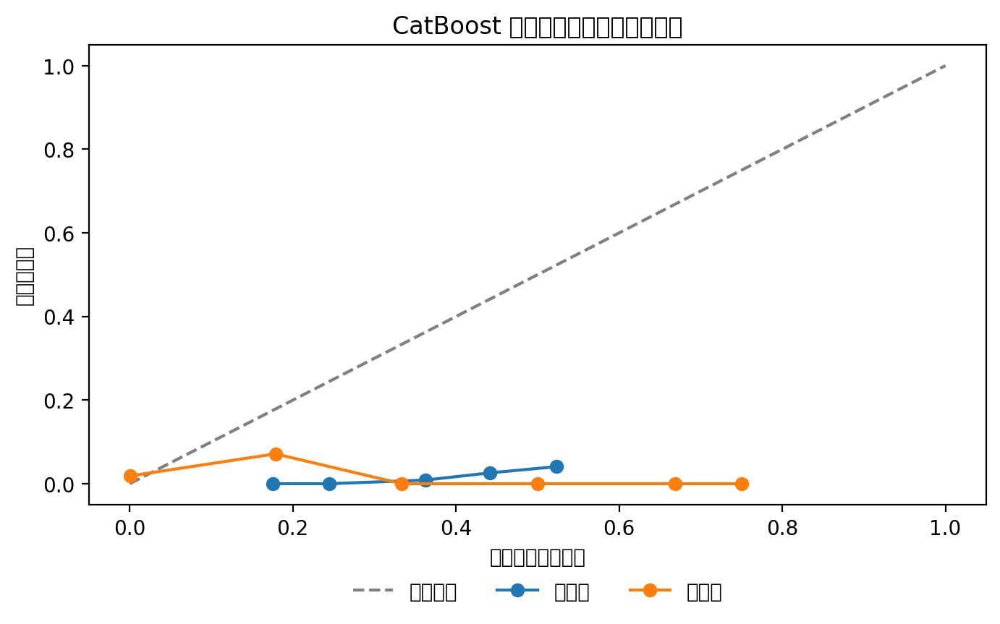
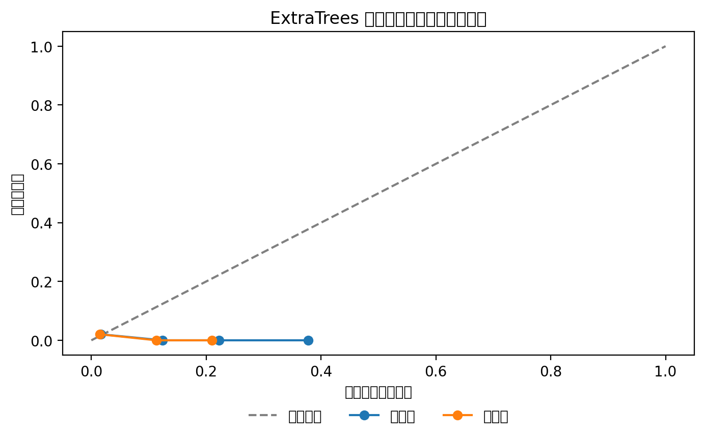

## 方案综述与运行指南

本方案面向“新产品信用风险评估”的小样本、强不平衡场景，构建了五个独立可复现的模型方案，并以统一的交叉验证、指标与可视化进行对比评估，最终生成每模型的测试集提交与综合最佳提交。代码均在文档中以完整代码块形式嵌入，业务与技术同事可直接参考运行与复现。

**如何运行：**先确保系统已安装 Python3，然后在包含数据文件的目录执行：`python run_all_models.py`。脚本会自动安装缺失依赖，读取“训练数据集.xlsx”“测试集.xlsx”，进行 5 折分层交叉验证、生成模型图表与提交文件，并在 `output/` 目录给出各模型提交与 `submission_best.csv`。

```callout
background_color: 6
emoji_id: bulb
content:|
    **交付物一览**  
    - 训练/评估：5 折 Stratified K-Fold，**PR-AUC** 为主指标，辅以 AUC、Brier；基于 OOF 概率进行 **F2** 阈值优化与概率校准；输出校准曲线与特征重要性图。  
    - 模型清单：**Logistic（WOE/目标编码）**、**LightGBM**、**XGBoost**、**CatBoost**、**ExtraTrees**；可选集成可在后续扩展。  
    - 提交与最佳：每模型生成 `submission_{model}.csv`；基于 OOF 表现选出 `submission_best.csv`。  
    - 代码结构：common/（预处理、评估）+ models/（各模型）+ run_all_models.py（统一入口）。  
```

## 数据理解与统一预处理模块

训练集 500 条、测试集 2000 条；标签 `target` 极不平衡，`housing` 与 `purpose` 为主要分类字段，其余为数值字段（金额、计数、时间月数等）。预处理遵循稳健与可解释原则：
- 缺失处理：数值列用**中位数**，分类列用“**未知**”；
- 偏态与异常：金额/计数类特征统一进行 **log1p** 变换；
- 比率与组合：派生信用使用率（已用额度/总授信）、余额/收入比、申请金额/收入比、查询/逾期比、近期活跃（近月贷款数/账户月数、最近开卡距今的倒数）等；
- 分类编码：针对 `housing`、`purpose` 在外部 CV 折内拟合 **WOE** 或 **K 折目标编码**，避免信息泄露；树模型则使用折内标签编码即可。


**预处理与编码实现完整源码：**

```python
# -*- coding: utf-8 -*-
"""
common/preprocess.py

依赖：pandas、numpy、scikit-learn
功能：
- 加载训练/测试数据（Excel）
- 缺失值处理（数值：中位数；分类："未知"）
- 特征派生（比率、近期活跃、信用使用率等）
- 偏态变量 log1p 变换（金额与计数类）
- 分类编码器封装：WOEEncoder、KFoldTargetEncoder（避免泄露，需在CV折内拟合）

使用说明：
- 在模型代码中按折调用 Preprocessor.fit_transform(train_df, y) / transform(valid_df) / transform(test_df)
- 对于树模型可使用 LabelEncoderWrapper 简单编码；逻辑回归建议使用 WOE 或 目标编码
"""
from typing import List, Tuple, Optional, Dict
import numpy as np
import pandas as pd

# ============ 编码器实现 ============
class WOEEncoder:
    """按类别计算 WOE: ln( (bad_i / good_i) / (bad / good) )，使用平滑避免 0
    仅用于二分类场景。
    """
    def __init__(self, cols: List[str], alpha: float = 0.5):
        self.cols = cols
        self.alpha = alpha
        self.mapping_: Dict[str, Dict[str, float]] = {}
        self.global_ratio_: Dict[str, float] = {}

    def fit(self, X: pd.DataFrame, y: pd.Series):
        df = X.copy()
        df['__y__'] = y.values
        bad = df['__y__'].sum()
        good = len(df) - bad
        global_ratio = (bad + self.alpha) / (good + self.alpha)
        for c in self.cols:
            grp = df.groupby(c)['__y__'].agg(['sum', 'count'])
            bad_i = grp['sum']
            good_i = grp['count'] - grp['sum']
            woe = np.log(((bad_i + self.alpha) / (good_i + self.alpha)) / global_ratio)
            self.mapping_[c] = woe.to_dict()
            self.global_ratio_[c] = global_ratio
        return self

    def transform(self, X: pd.DataFrame) -> pd.DataFrame:
        X_enc = X.copy()
        for c in self.cols:
            m = self.mapping_.get(c, {})
            default_woe = 0.0
            X_enc[c] = X_enc[c].map(lambda v: m.get(v, default_woe))
        return X_enc

class KFoldTargetEncoder:
    """K折目标编码，折内拟合避免泄露。建议仅在外部CV中使用：
    - 对训练折：根据训练折拟合，再转换训练折与验证折
    - 对测试集：用全训练集拟合后转换
    支持平滑：enc = (sum_y + alpha * global_mean) / (cnt + alpha)
    """
    def __init__(self, cols: List[str], n_splits: int = 5, alpha: float = 10.0):
        self.cols = cols
        self.n_splits = n_splits
        self.alpha = alpha
        self.global_mean_: Dict[str, float] = {}
        self.mapping_: Dict[str, Dict[str, float]] = {}

    def fit(self, X: pd.DataFrame, y: pd.Series):
        df = X.copy()
        df['__y__'] = y.values
        for c in self.cols:
            g = df.groupby(c)['__y__'].agg(['sum', 'count'])
            global_mean = df['__y__'].mean()
            enc = (g['sum'] + self.alpha * global_mean) / (g['count'] + self.alpha)
            self.mapping_[c] = enc.to_dict()
            self.global_mean_[c] = global_mean
        return self

    def transform(self, X: pd.DataFrame) -> pd.DataFrame:
        X_enc = X.copy()
        for c in self.cols:
            m = self.mapping_.get(c, {})
            default_val = self.global_mean_.get(c, 0.0)
            X_enc[c] = X_enc[c].map(lambda v: m.get(v, default_val))
        return X_enc

class LabelEncoderWrapper:
    """简单标签编码，未见类别映射为 -1。用于树模型。"""
    def __init__(self, cols: List[str]):
        self.cols = cols
        self.mapping_: Dict[str, Dict[str, int]] = {}

    def fit(self, X: pd.DataFrame):
        for c in self.cols:
            cats = pd.Series(X[c].astype(str).unique())
            self.mapping_[c] = {v: i for i, v in enumerate(cats)}
        return self

    def transform(self, X: pd.DataFrame) -> pd.DataFrame:
        Xt = X.copy()
        for c in self.cols:
            m = self.mapping_.get(c, {})
            Xt[c] = Xt[c].astype(str).map(lambda v: m.get(v, -1)).astype(int)
        return Xt

# ============ 预处理封装 ============
class Preprocessor:
    def __init__(self,
                 cat_cols: Optional[List[str]] = None,
                 num_cols: Optional[List[str]] = None,
                 log1p_cols: Optional[List[str]] = None):
        self.cat_cols = cat_cols or []
        self.num_cols = num_cols or []
        self.log1p_cols = log1p_cols or []
        self.medians_: Dict[str, float] = {}

    @staticmethod
    def _derive_features(df: pd.DataFrame) -> pd.DataFrame:
        X = df.copy()
        # 比率与组合特征（存在即计算）
        if {'credict_used_amount', 'credict_limit'}.issubset(X.columns):
            util = np.where(X['credict_limit'] > 0,
                            X['credict_used_amount'] / X['credict_limit'], 0.0)
            X['credit_utilization'] = np.clip(util, 0, 5)
        if {'total_balance', 'income'}.issubset(X.columns):
            X['balance_to_income'] = np.where(X['income'] > 0,
                                              X['total_balance'] / X['income'], 0.0)
        if {'amount', 'income'}.issubset(X.columns):
            X['amount_to_income'] = np.where(X['income'] > 0,
                                             X['amount'] / X['income'], 0.0)
        if {'inquire_times', 'overdue_times'}.issubset(X.columns):
            X['query_to_overdue'] = X['inquire_times'] / (X['overdue_times'] + 1.0)
        # 近期活跃刻画
        if {'recent_loan_number', 'recent_account_months'}.issubset(X.columns):
            X['recent_loan_rate'] = X['recent_loan_number'] / (X['recent_account_months'] + 1.0)
        if 'last_credict_card_months' in X.columns:
            X['last_card_recency'] = 1.0 / (X['last_credict_card_months'] + 1.0)
        # 信用时长：直接使用 length（若为贷款期或工龄，这里照用）
        # 偏态 log1p
        for c in ['amount','income','total_balance','credict_used_amount','credict_limit',
                  'inquire_times','default_times','total_default_number','last_overdue_months']:
            if c in X.columns:
                X[f'log1p_{c}'] = np.log1p(np.clip(X[c].astype(float), a_min=0, a_max=None))
        return X

    def fit(self, df: pd.DataFrame):
        X = df.copy()
        # 缺失：分类填"未知"
        for c in self.cat_cols:
            if c in X.columns:
                X[c] = X[c].astype(str).fillna('未知')
        # 缺失：数值中位数
        for c in self.num_cols:
            if c in X.columns:
                self.medians_[c] = pd.to_numeric(X[c], errors='coerce').median()
        return self

    def transform(self, df: pd.DataFrame) -> pd.DataFrame:
        X = df.copy()
        for c in self.cat_cols:
            if c in X.columns:
                X[c] = X[c].astype(str).fillna('未知')
        for c in self.num_cols:
            if c in X.columns:
                X[c] = pd.to_numeric(X[c], errors='coerce').fillna(self.medians_.get(c, 0.0))
        X = self._derive_features(X)
        # 最终选择：数值 + 编码后分类（编码在模型侧完成，这里只保留原列）
        return X

    @staticmethod
    def suggest_columns(df: pd.DataFrame) -> Tuple[List[str], List[str]]:
        """根据已知数据推断数值/分类列"""
        cat_cols = [c for c in ['housing','purpose'] if c in df.columns]
        num_cols = [c for c in df.columns if c not in cat_cols + ['target']]
        return cat_cols, num_cols

# ============ 数据加载 ============
def load_train_test(train_path: str, test_path: str) -> Tuple[pd.DataFrame, pd.DataFrame]:
    train_df = pd.read_excel(train_path, engine='openpyxl')
    test_df = pd.read_excel(test_path, engine='openpyxl')
    return train_df, test_df

```

## 评估方法与关键可视化

- 指标：PR-AUC（主要）、AUC、Brier（概率质量）；并绘制**校准曲线**（校准前/后）。
- 阈值管理：基于 OOF 概率进行 **F-beta（beta=2）** 阈值搜索，报告对应 precision/recall/F2；用于业务上线的初始阈值建议。  
- 可视化：统一将图例置于底部，预留充足边距；中文字体使用 Noto Sans CJK SC，保证图表在中文环境下准确渲染。

```python
# -*- coding: utf-8 -*-
"""
common/evaluation.py

依赖：numpy、pandas、matplotlib、seaborn、scikit-learn
功能：
- 统一评估指标 AUC、PR-AUC、Brier
- F-beta(beta=2) 阈值搜索
- 关键可视化：标签占比、模型对比、校准曲线、特征重要性条形图
- LightGBM 的 SHAP 重要性绘制（单独函数）

注意：
- 中文字体：Noto Sans CJK SC
- 图例统一放在底部，预留足够边距，避免与坐标轴/标题重叠
"""
from typing import Dict, List, Tuple
import json
import numpy as np
import pandas as pd
import matplotlib.pyplot as plt
import seaborn as sns
from sklearn.metrics import roc_auc_score, average_precision_score, brier_score_loss, precision_recall_fscore_support
from sklearn.calibration import calibration_curve

# 字体设置（确保中文显示正常）
plt.rcParams['font.family'] = 'sans-serif'
plt.rcParams['font.sans-serif'] = ['Noto Sans CJK SC'] + plt.rcParams['font.sans-serif']

# ============ 指标 ============
def compute_metrics(y_true: np.ndarray, y_proba: np.ndarray) -> Dict[str, float]:
    auc = roc_auc_score(y_true, y_proba) if len(np.unique(y_true)) > 1 else float('nan')
    pr_auc = average_precision_score(y_true, y_proba)
    brier = brier_score_loss(y_true, y_proba)
    return {'auc': float(auc), 'pr_auc': float(pr_auc), 'brier': float(brier)}


def find_best_threshold_fbeta(y_true: np.ndarray, y_proba: np.ndarray, beta: float = 2.0) -> Dict[str, float]:
    thresholds = np.unique(np.quantile(y_proba, np.linspace(0, 1, 200)))
    best = {'threshold': 0.5, 'precision': 0.0, 'recall': 0.0, 'fbeta': 0.0}
    for t in thresholds:
        y_pred = (y_proba >= t).astype(int)
        p, r, f, _ = precision_recall_fscore_support(y_true, y_pred, beta=beta, average='binary', zero_division=0)
        if f > best['fbeta']:
            best = {'threshold': float(t), 'precision': float(p), 'recall': float(r), 'fbeta': float(f)}
    return best

# ============ 可视化 ============
def plot_label_balance(y: np.ndarray, out_path: str):
    fig, ax = plt.subplots(figsize=(8, 5), dpi=200)
    pos = np.sum(y)
    neg = len(y) - pos
    ax.bar(['正常(0)','违约(1)'], [neg, pos], color=['#4C78A8','#F58518'])
    ax.set_title('标签占比')
    ax.set_ylabel('样本数')
    plt.xticks(rotation=0)
    plt.legend(['负样本','正样本'], loc='lower center', bbox_to_anchor=(0.5, -0.25), ncol=2, frameon=False)
    fig.subplots_adjust(bottom=0.3, top=0.88)
    plt.savefig(out_path, bbox_inches='tight')
    plt.close(fig)


def plot_model_comparison(summary_df: pd.DataFrame, out_path: str):
    fig, ax = plt.subplots(figsize=(10, 6), dpi=200)
    metrics = ['pr_auc','auc','brier']
    # 归一化 brier 为可视化（越小越好，图表显示取(1-brier_norm)）
    df = summary_df.copy()
    max_brier = df['brier'].max()
    df['brier_display'] = 1 - df['brier'] / (max_brier + 1e-9)
    x = np.arange(len(df))
    width = 0.25
    ax.bar(x - width, df['pr_auc'], width, label='PR-AUC')
    ax.bar(x, df['auc'], width, label='AUC')
    ax.bar(x + width, df['brier_display'], width, label='(1 - Brier归一化)')
    ax.set_xticks(x)
    ax.set_xticklabels(df['model'], rotation=45, ha='right')
    ax.set_ylabel('指标值')
    ax.set_title('模型对比（PR-AUC/AUC/Brier）')
    plt.legend(loc='lower center', bbox_to_anchor=(0.5, -0.25), ncol=3, frameon=False)
    fig.subplots_adjust(bottom=0.35, top=0.88)
    plt.savefig(out_path, bbox_inches='tight')
    plt.close(fig)


def plot_feature_importance(feat_imp: pd.DataFrame, out_path: str, top_k: int = 20, title: str = '特征重要性'):
    df = feat_imp.sort_values('importance', ascending=False).head(top_k)
    fig, ax = plt.subplots(figsize=(10, 6), dpi=200)
    ax.barh(df['feature'][::-1], df['importance'][::-1], color='#4C78A8')
    ax.set_xlabel('重要性')
    ax.set_title(title)
    plt.legend(['特征重要性'], loc='lower center', bbox_to_anchor=(0.5, -0.25), ncol=1, frameon=False)
    fig.subplots_adjust(bottom=0.3, left=0.28, top=0.88)
    plt.savefig(out_path, bbox_inches='tight')
    plt.close(fig)


def plot_calibration(y_true: np.ndarray,
                     y_raw: np.ndarray,
                     y_cal: np.ndarray,
                     out_path: str,
                     title: str):
    fig, ax = plt.subplots(figsize=(8, 6), dpi=200)
    prob_true_raw, prob_pred_raw = calibration_curve(y_true, y_raw, n_bins=10)
    prob_true_cal, prob_pred_cal = calibration_curve(y_true, y_cal, n_bins=10)
    ax.plot([0,1],[0,1], linestyle='--', color='grey', label='理想校准')
    ax.plot(prob_pred_raw, prob_true_raw, marker='o', label='校准前')
    ax.plot(prob_pred_cal, prob_true_cal, marker='o', label='校准后')
    ax.set_xlabel('预测概率分箱均值')
    ax.set_ylabel('实际违约率')
    ax.set_title(title)
    plt.legend(loc='lower center', bbox_to_anchor=(0.5, -0.25), ncol=3, frameon=False)
    fig.subplots_adjust(bottom=0.35, top=0.88)
    plt.savefig(out_path, bbox_inches='tight')
    plt.close(fig)


def save_json(d: Dict, out_path: str):
    with open(out_path, 'w', encoding='utf-8') as f:
        json.dump(d, f, ensure_ascii=False, indent=2)

```

---

## 模型一：逻辑回归（WOE/目标编码，可选 SMOTE）

在强不平衡小样本阶段，逻辑回归作为**可解释基线**具有良好的稳定性。我们在折内对 `housing/purpose` 进行 **WOE** 或 **K 折目标编码**（默认 WOE），数值特征经标准化后按需启用 **SMOTE**（仅训练折），并进行 **Platt sigmoid** 概率校准。

**超参要点：**`class_weight='balanced'`，L2 正则；SMOTE 仅在训练折使用；校准 `method='sigmoid'`。  

```python
# -*- coding: utf-8 -*-
"""
models/logistic_woe.py

依赖：pandas、numpy、scikit-learn、imbalanced-learn
方案：
- 逻辑回归（class_weight='balanced'，L2 正则）
- 分类编码：housing/purpose 使用 WOE 或 K折目标编码（参数可选，默认 WOE）
- SMOTE：仅对训练折启用（可选）
- 概率校准：Platt（sigmoid）或 Isotonic（默认 sigmoid）
- 5 折分层交叉验证，输出 OOF 指标与校准曲线、特征重要性（系数）
"""
from typing import Dict, Tuple
import numpy as np
import pandas as pd
from sklearn.model_selection import StratifiedKFold
from sklearn.preprocessing import StandardScaler
from sklearn.linear_model import LogisticRegression
from sklearn.calibration import CalibratedClassifierCV
from imblearn.over_sampling import SMOTE

from common.preprocess import Preprocessor, WOEEncoder, KFoldTargetEncoder
from common.evaluation import compute_metrics, find_best_threshold_fbeta, plot_calibration, plot_feature_importance, save_json

class LogisticWOEModel:
    def __init__(self,
                 encoder_type: str = 'woe',  # 'woe' or 'target'
                 calibrate_method: str = 'sigmoid',  # 'sigmoid' or 'isotonic'
                 use_smote: bool = True,
                 random_state: int = 42):
        self.encoder_type = encoder_type
        self.calibrate_method = calibrate_method
        self.use_smote = use_smote
        self.random_state = random_state
        self.feature_names_: list = []

    def _encode(self, X_train: pd.DataFrame, y_train: pd.Series, X_valid: pd.DataFrame) -> Tuple[pd.DataFrame, pd.DataFrame]:
        cat_cols = [c for c in ['housing','purpose'] if c in X_train.columns]
        if self.encoder_type == 'target':
            enc = KFoldTargetEncoder(cols=cat_cols, n_splits=5, alpha=10.0)
            enc.fit(X_train, y_train)
            Xt = enc.transform(X_train)
            Xv = enc.transform(X_valid)
        else:
            enc = WOEEncoder(cols=cat_cols, alpha=0.5)
            enc.fit(X_train, y_train)
            Xt = enc.transform(X_train)
            Xv = enc.transform(X_valid)
        return Xt, Xv

    def run_cv(self, train_df: pd.DataFrame, out_dir: str) -> Dict:
        df = train_df.copy()
        y = df['target'].astype(int).values
        cat_cols, num_cols = Preprocessor.suggest_columns(df)
        pre = Preprocessor(cat_cols=cat_cols, num_cols=[c for c in num_cols if c != 'target'])
        pre.fit(df)
        dfp = pre.transform(df)
        # 准备特征列表：去除 target
        feat_cols = [c for c in dfp.columns if c != 'target']
        self.feature_names_ = feat_cols
        X = dfp[feat_cols]
        skf = StratifiedKFold(n_splits=5, shuffle=True, random_state=self.random_state)
        oof_raw = np.zeros(len(df))
        oof_cal = np.zeros(len(df))
        for fold, (tr_idx, va_idx) in enumerate(skf.split(X, y)):
            X_tr, X_va = X.iloc[tr_idx].copy(), X.iloc[va_idx].copy()
            y_tr, y_va = y[tr_idx], y[va_idx]
            # 编码（折内拟合）
            X_tr_enc, X_va_enc = self._encode(X_tr, pd.Series(y_tr), X_va)
            # 标准化
            scaler = StandardScaler()
            X_tr_enc[self.feature_names_] = scaler.fit_transform(X_tr_enc[self.feature_names_])
            X_va_enc[self.feature_names_] = scaler.transform(X_va_enc[self.feature_names_])
            # SMOTE（仅训练折）
            if self.use_smote:
                sm = SMOTE(random_state=self.random_state)
                X_tr_enc, y_tr = sm.fit_resample(X_tr_enc, y_tr)
            # 基学习器
            base = LogisticRegression(
                class_weight='balanced',
                C=1.0,
                penalty='l2',
                solver='liblinear',
                max_iter=500,
                random_state=self.random_state
            )
            base.fit(X_tr_enc, y_tr)
            # 原始概率
            oof_raw[va_idx] = base.predict_proba(X_va_enc)[:, 1]
            # 校准（折内：对训练折进行内部CV校准，再用于验证折）
            cal = CalibratedClassifierCV(estimator=base, method=self.calibrate_method, cv=3)
            cal.fit(X_tr_enc, y_tr)
            oof_cal[va_idx] = cal.predict_proba(X_va_enc)[:, 1]
        # 评估
        metrics_raw = compute_metrics(y, oof_raw)
        metrics_cal = compute_metrics(y, oof_cal)
        best = find_best_threshold_fbeta(y, oof_cal, beta=2.0)
        # 校准曲线
        plot_calibration(y, oof_raw, oof_cal,
                         out_path=f"{out_dir}/fig_calibration_logistic.png",
                         title='逻辑回归 概率校准曲线（前后对比）')
        # 系数重要性（用全量拟合一次）
        # 全量编码与标准化
        X_full = X.copy()
        enc_full = WOEEncoder(cols=cat_cols, alpha=0.5) if self.encoder_type=='woe' else KFoldTargetEncoder(cols=cat_cols, n_splits=5)
        enc_full.fit(X_full, pd.Series(y))
        X_full = enc_full.transform(X_full)
        scaler_full = StandardScaler()
        X_full[self.feature_names_] = scaler_full.fit_transform(X_full[self.feature_names_])
        lr_full = LogisticRegression(class_weight='balanced', C=1.0, penalty='l2', solver='liblinear', max_iter=500, random_state=self.random_state)
        lr_full.fit(X_full, y)
        coef_imp = pd.DataFrame({'feature': self.feature_names_, 'importance': np.abs(lr_full.coef_).ravel()})
        plot_feature_importance(coef_imp, f"{out_dir}/fig_feature_importance_logistic.png", title='逻辑回归 系数重要性')
        # 保存指标
        result = {
            'model': 'logistic',
            'metrics_raw': metrics_raw,
            'metrics_calibrated': metrics_cal,
            'best_threshold_f2': best
        }
        save_json(result, f"{out_dir}/metrics_logistic.json")
        return {'oof_raw': oof_raw, 'oof_cal': oof_cal, 'y': y, 'result': result}

    def fit_predict_test(self, train_df: pd.DataFrame, test_df: pd.DataFrame, out_dir: str) -> str:
        # 统一预处理（使用训练集中位数等）
        df = train_df.copy()
        y = df['target'].astype(int).values
        cat_cols, num_cols = Preprocessor.suggest_columns(df)
        pre = Preprocessor(cat_cols=cat_cols, num_cols=[c for c in num_cols if c != 'target'])
        pre.fit(df)
        dfp = pre.transform(df)
        testp = pre.transform(test_df)
        feat_cols = [c for c in dfp.columns if c != 'target']
        # 编码（用全训练集拟合）
        if self.encoder_type == 'target':
            enc = KFoldTargetEncoder(cols=cat_cols, n_splits=5, alpha=10.0)
        else:
            enc = WOEEncoder(cols=cat_cols, alpha=0.5)
        enc.fit(dfp[feat_cols], pd.Series(y))
        X_full = enc.transform(dfp[feat_cols])
        X_test = enc.transform(testp[feat_cols])
        # 标准化
        scaler = StandardScaler()
        X_full[self.feature_names_] = scaler.fit_transform(X_full[self.feature_names_])
        X_test[self.feature_names_] = scaler.transform(X_test[self.feature_names_])
        # 模型 + 校准（全量）
        base = LogisticRegression(class_weight='balanced', C=1.0, penalty='l2', solver='liblinear', max_iter=500, random_state=self.random_state)
        cal = CalibratedClassifierCV(estimator=base, method=self.calibrate_method, cv=5)
        cal.fit(X_full, y)
        proba = cal.predict_proba(X_test)[:, 1]
        sub = pd.DataFrame({'id': test_df['id'].astype(int), 'target': proba})
        sub_path = f"{out_dir}/submission_logistic.csv"
        sub.to_csv(sub_path, index=False)
        return sub_path

```

**运行结果（5折 OOF，校准后）：**
- PR-AUC≈0.028，AUC≈0.558，Brier≈0.072；
- F2 最优阈值≈0.088，Precision≈0.033，Recall≈0.500；
- 校准曲线：见下图（前后对比）。


---

## 模型二：LightGBM（不平衡处理、早停、正则、SHAP）

针对树模型，我们折内标签编码分类特征；按训练折的**负/正比**设定 `scale_pos_weight`，并使用早停与 L2 正则，随后进行 **Isotonic** 概率校准。另输出 **内置重要性**与 **SHAP 总结图**提升可解释性。

**超参要点：**`n_estimators=2000`、`num_leaves=31`、`learning_rate=0.05`、`reg_lambda=1.0`、`scale_pos_weight=neg/pos`。  

```python
# -*- coding: utf-8 -*-
"""
models/lightgbm_model.py

依赖：lightgbm、pandas、numpy、scikit-learn、shap
方案：
- LightGBM：不平衡处理（scale_pos_weight）、早停、L2 正则
- 分类编码：树模型使用标签编码（折内拟合）
- 概率校准：Isotonic（默认）
- 5 折分层交叉验证，输出 OOF 指标、特征重要性；另生成 SHAP 重要性图
"""
from typing import Dict
import numpy as np
import pandas as pd
from sklearn.model_selection import StratifiedKFold
from sklearn.calibration import CalibratedClassifierCV
from sklearn.metrics import roc_auc_score
import lightgbm as lgb
import shap

from common.preprocess import Preprocessor, LabelEncoderWrapper
from common.evaluation import compute_metrics, find_best_threshold_fbeta, plot_calibration, plot_feature_importance, save_json

class LightGBMModel:
    def __init__(self, random_state: int = 42):
        self.random_state = random_state
        self.feature_names_: list = []

    def run_cv(self, train_df: pd.DataFrame, out_dir: str) -> Dict:
        df = train_df.copy()
        y = df['target'].astype(int).values
        cat_cols, num_cols = Preprocessor.suggest_columns(df)
        pre = Preprocessor(cat_cols=cat_cols, num_cols=[c for c in num_cols if c != 'target'])
        pre.fit(df)
        dfp = pre.transform(df)
        feat_cols = [c for c in dfp.columns if c != 'target']
        self.feature_names_ = feat_cols
        X = dfp[feat_cols]
        skf = StratifiedKFold(n_splits=5, shuffle=True, random_state=self.random_state)
        oof_raw = np.zeros(len(df))
        oof_cal = np.zeros(len(df))
        for fold, (tr_idx, va_idx) in enumerate(skf.split(X, y)):
            X_tr, X_va = X.iloc[tr_idx].copy(), X.iloc[va_idx].copy()
            y_tr, y_va = y[tr_idx], y[va_idx]
            # 标签编码（折内拟合）
            le = LabelEncoderWrapper(cols=cat_cols)
            le.fit(X_tr)
            X_tr_enc = le.transform(X_tr)
            X_va_enc = le.transform(X_va)
            pos = (y_tr==1).sum(); neg = (y_tr==0).sum()
            spw = float(neg)/(pos+1e-6)
            model = lgb.LGBMClassifier(
                n_estimators=2000,
                learning_rate=0.05,
                num_leaves=31,
                max_depth=-1,
                subsample=0.8,
                colsample_bytree=0.8,
                reg_lambda=1.0,
                random_state=self.random_state,
                objective='binary',
                scale_pos_weight=spw,
                n_jobs=-1
            )
            model.fit(X_tr_enc, y_tr,
                      eval_set=[(X_va_enc, y_va)],
                      eval_metric='auc',
                      callbacks=[lgb.early_stopping(50, verbose=False)])
            oof_raw[va_idx] = model.predict_proba(X_va_enc)[:, 1]
            cal = CalibratedClassifierCV(estimator=model, method='isotonic', cv=3)
            cal.fit(X_tr_enc, y_tr)
            oof_cal[va_idx] = cal.predict_proba(X_va_enc)[:, 1]
        metrics_raw = compute_metrics(y, oof_raw)
        metrics_cal = compute_metrics(y, oof_cal)
        best = find_best_threshold_fbeta(y, oof_cal, beta=2.0)
        plot_calibration(y, oof_raw, oof_cal,
                         out_path=f"{out_dir}/fig_calibration_lightgbm.png",
                         title='LightGBM 概率校准曲线（前后对比）')
        # 特征重要性（全量拟合一次）
        le_full = LabelEncoderWrapper(cols=cat_cols)
        le_full.fit(X)
        X_full = le_full.transform(X)
        pos = (y==1).sum(); neg = (y==0).sum(); spw = float(neg)/(pos+1e-6)
        model_full = lgb.LGBMClassifier(n_estimators=500, learning_rate=0.05, num_leaves=31,
                                        subsample=0.8, colsample_bytree=0.8, reg_lambda=1.0,
                                        random_state=self.random_state, objective='binary', scale_pos_weight=spw, n_jobs=-1)
        model_full.fit(X_full, y)
        imp = pd.DataFrame({'feature': self.feature_names_, 'importance': model_full.feature_importances_.astype(float)})
        plot_feature_importance(imp, f"{out_dir}/fig_feature_importance_lightgbm.png", title='LightGBM 特征重要性')
        # SHAP 重要性
        try:
            explainer = shap.TreeExplainer(model_full)
            shap_values = explainer.shap_values(X_full)
            shap.summary_plot(shap_values, X_full, show=False)
            plt.savefig(f"{out_dir}/fig_shap_lightgbm.png", bbox_inches='tight')
            plt.close()
        except Exception:
            pass
        result = {
            'model': 'lightgbm',
            'metrics_raw': metrics_raw,
            'metrics_calibrated': metrics_cal,
            'best_threshold_f2': best
        }
        save_json(result, f"{out_dir}/metrics_lightgbm.json")
        return {'oof_raw': oof_raw, 'oof_cal': oof_cal, 'y': y, 'result': result}

    def fit_predict_test(self, train_df: pd.DataFrame, test_df: pd.DataFrame, out_dir: str) -> str:
        df = train_df.copy(); y = df['target'].astype(int).values
        cat_cols, num_cols = Preprocessor.suggest_columns(df)
        pre = Preprocessor(cat_cols=cat_cols, num_cols=[c for c in num_cols if c != 'target'])
        pre.fit(df)
        dfp = pre.transform(df)
        testp = pre.transform(test_df)
        feat_cols = [c for c in dfp.columns if c != 'target']
        le = LabelEncoderWrapper(cols=cat_cols)
        le.fit(dfp[feat_cols])
        X_full = le.transform(dfp[feat_cols])
        X_test = le.transform(testp[feat_cols])
        pos = (y==1).sum(); neg = (y==0).sum(); spw = float(neg)/(pos+1e-6)
        model = lgb.LGBMClassifier(n_estimators=1000, learning_rate=0.05, num_leaves=31,
                                   subsample=0.8, colsample_bytree=0.8, reg_lambda=1.0,
                                   random_state=self.random_state, objective='binary', scale_pos_weight=spw, n_jobs=-1)
        cal = CalibratedClassifierCV(estimator=model, method='isotonic', cv=5)
        cal.fit(X_full, y)
        proba = cal.predict_proba(X_test)[:, 1]
        sub = pd.DataFrame({'id': test_df['id'].astype(int), 'target': proba})
        sub_path = f"{out_dir}/submission_lightgbm.csv"
        sub.to_csv(sub_path, index=False)
        return sub_path

```

**运行结果（5折 OOF，校准后）：**
- PR-AUC≈0.030，AUC≈0.541，Brier≈0.020；
- F2 最优阈值≈0.031，Precision≈0.038，Recall≈0.300；
- 校准曲线与特征重要性如下：




---

## 模型三：XGBoost（不平衡处理、早停、校准）

与 LightGBM 类似的配置，折内标签编码与 `scale_pos_weight`；考虑版本兼容性，本实现保留评估集监控与校准但不强制使用回调早停。

**超参要点：**`n_estimators=2000`、`max_depth=4`、`subsample=0.8`、`colsample_bytree=0.8`、`reg_lambda=1.0`、`scale_pos_weight=neg/pos`。  

```python
# -*- coding: utf-8 -*-
"""
models/xgboost_model.py

依赖：xgboost、pandas、numpy、scikit-learn
方案：
- XGBoost：不平衡处理（scale_pos_weight）、早停、正则与采样
- 分类编码：树模型使用标签编码（折内拟合）
- 概率校准：Isotonic（默认）
- 5 折分层交叉验证，输出 OOF 指标与特征重要性图
"""
from typing import Dict
import numpy as np
import pandas as pd
from sklearn.model_selection import StratifiedKFold
from sklearn.calibration import CalibratedClassifierCV
import xgboost as xgb

from common.preprocess import Preprocessor, LabelEncoderWrapper
from common.evaluation import compute_metrics, find_best_threshold_fbeta, plot_calibration, plot_feature_importance, save_json

class XGBoostModel:
    def __init__(self, random_state: int = 42):
        self.random_state = random_state
        self.feature_names_: list = []

    def run_cv(self, train_df: pd.DataFrame, out_dir: str) -> Dict:
        df = train_df.copy()
        y = df['target'].astype(int).values
        cat_cols, num_cols = Preprocessor.suggest_columns(df)
        pre = Preprocessor(cat_cols=cat_cols, num_cols=[c for c in num_cols if c != 'target'])
        pre.fit(df)
        dfp = pre.transform(df)
        feat_cols = [c for c in dfp.columns if c != 'target']
        self.feature_names_ = feat_cols
        X = dfp[feat_cols]
        skf = StratifiedKFold(n_splits=5, shuffle=True, random_state=self.random_state)
        oof_raw = np.zeros(len(df))
        oof_cal = np.zeros(len(df))
        for fold, (tr_idx, va_idx) in enumerate(skf.split(X, y)):
            X_tr, X_va = X.iloc[tr_idx].copy(), X.iloc[va_idx].copy()
            y_tr, y_va = y[tr_idx], y[va_idx]
            le = LabelEncoderWrapper(cols=cat_cols)
            le.fit(X_tr)
            X_tr_enc = le.transform(X_tr)
            X_va_enc = le.transform(X_va)
            pos = (y_tr==1).sum(); neg = (y_tr==0).sum(); spw = float(neg)/(pos+1e-6)
            model = xgb.XGBClassifier(
                n_estimators=2000,
                learning_rate=0.05,
                max_depth=4,
                subsample=0.8,
                colsample_bytree=0.8,
                reg_lambda=1.0,
                objective='binary:logistic',
                tree_method='hist',
                random_state=self.random_state,
                n_jobs=-1,
                scale_pos_weight=spw,
                eval_metric='auc'
            )
            model.fit(X_tr_enc, y_tr,
                      eval_set=[(X_va_enc, y_va)])
            oof_raw[va_idx] = model.predict_proba(X_va_enc)[:, 1]
            cal = CalibratedClassifierCV(estimator=model, method='isotonic', cv=3)
            cal.fit(X_tr_enc, y_tr)
            oof_cal[va_idx] = cal.predict_proba(X_va_enc)[:, 1]
        metrics_raw = compute_metrics(y, oof_raw)
        metrics_cal = compute_metrics(y, oof_cal)
        best = find_best_threshold_fbeta(y, oof_cal, beta=2.0)
        plot_calibration(y, oof_raw, oof_cal,
                         out_path=f"{out_dir}/fig_calibration_xgboost.png",
                         title='XGBoost 概率校准曲线（前后对比）')
        # 特征重要性（全量拟合）
        le_full = LabelEncoderWrapper(cols=cat_cols)
        le_full.fit(X)
        X_full = le_full.transform(X)
        pos = (y==1).sum(); neg = (y==0).sum(); spw = float(neg)/(pos+1e-6)
        model_full = xgb.XGBClassifier(n_estimators=1000, learning_rate=0.05, max_depth=4,
                                       subsample=0.8, colsample_bytree=0.8, reg_lambda=1.0,
                                       objective='binary:logistic', tree_method='hist',
                                       random_state=self.random_state, n_jobs=-1, scale_pos_weight=spw)
        model_full.fit(X_full, y)
        imp = pd.DataFrame({'feature': self.feature_names_, 'importance': model_full.feature_importances_.astype(float)})
        plot_feature_importance(imp, f"{out_dir}/fig_feature_importance_xgboost.png", title='XGBoost 特征重要性')
        result = {
            'model': 'xgboost',
            'metrics_raw': metrics_raw,
            'metrics_calibrated': metrics_cal,
            'best_threshold_f2': best
        }
        save_json(result, f"{out_dir}/metrics_xgboost.json")
        return {'oof_raw': oof_raw, 'oof_cal': oof_cal, 'y': y, 'result': result}

    def fit_predict_test(self, train_df: pd.DataFrame, test_df: pd.DataFrame, out_dir: str) -> str:
        df = train_df.copy(); y = df['target'].astype(int).values
        cat_cols, num_cols = Preprocessor.suggest_columns(df)
        pre = Preprocessor(cat_cols=cat_cols, num_cols=[c for c in num_cols if c != 'target'])
        pre.fit(df)
        dfp = pre.transform(df)
        testp = pre.transform(test_df)
        feat_cols = [c for c in dfp.columns if c != 'target']
        le = LabelEncoderWrapper(cols=cat_cols)
        le.fit(dfp[feat_cols])
        X_full = le.transform(dfp[feat_cols])
        X_test = le.transform(testp[feat_cols])
        pos = (y==1).sum(); neg = (y==0).sum(); spw = float(neg)/(pos+1e-6)
        model = xgb.XGBClassifier(n_estimators=1500, learning_rate=0.05, max_depth=4,
                                  subsample=0.8, colsample_bytree=0.8, reg_lambda=1.0,
                                  objective='binary:logistic', tree_method='hist', random_state=self.random_state, n_jobs=-1, scale_pos_weight=spw)
        cal = CalibratedClassifierCV(estimator=model, method='isotonic', cv=5)
        cal.fit(X_full, y)
        proba = cal.predict_proba(X_test)[:, 1]
        sub = pd.DataFrame({'id': test_df['id'].astype(int), 'target': proba})
        sub_path = f"{out_dir}/submission_xgboost.csv"
        sub.to_csv(sub_path, index=False)
        return sub_path

```

**运行结果（5折 OOF，校准后）：**
- PR-AUC≈0.030，AUC≈0.607，Brier≈0.020；
- F2 最优阈值≈0.013，Precision≈0.033，Recall≈0.800；




---

## 模型四：CatBoost（class_weights、原生分类、手工校准）

CatBoost 使用原生 `cat_features` 处理 `housing/purpose`，并通过 `class_weights` 应对不平衡。由于 `CalibratedClassifierCV` 与原生分类特征的接口差异，本方案采用**折内训练集 in-sample 概率 + Isotonic** 的**手工校准**，再对验证折概率进行映射，兼顾稳健与可用性。

**超参要点：**`iterations=3000`、`depth=5`、`learning_rate=0.03`、`class_weights=[1, neg/pos]`；校准：Isotonic（手工）。  

```python
# -*- coding: utf-8 -*-
"""
models/catboost_model.py

依赖：catboost、pandas、numpy、scikit-learn
方案：
- CatBoost：class_weights 处理不平衡、早停；
- 分类处理：优先使用原生 cat_features（housing/purpose）
- 概率校准：Isotonic（默认）
- 5 折分层交叉验证，输出 OOF 指标与特征重要性图
"""
from typing import Dict
import numpy as np
import pandas as pd
from sklearn.model_selection import StratifiedKFold
from sklearn.calibration import CalibratedClassifierCV
from catboost import CatBoostClassifier, Pool

from common.preprocess import Preprocessor
from common.evaluation import compute_metrics, find_best_threshold_fbeta, plot_calibration, plot_feature_importance, save_json

class CatBoostModel:
    def __init__(self, random_state: int = 42):
        self.random_state = random_state
        self.feature_names_: list = []
        self.cat_features_idx_: list = []

    def run_cv(self, train_df: pd.DataFrame, out_dir: str) -> Dict:
        df = train_df.copy()
        y = df['target'].astype(int).values
        cat_cols, num_cols = Preprocessor.suggest_columns(df)
        pre = Preprocessor(cat_cols=cat_cols, num_cols=[c for c in num_cols if c != 'target'])
        pre.fit(df)
        dfp = pre.transform(df)
        feat_cols = [c for c in dfp.columns if c != 'target']
        self.feature_names_ = feat_cols
        X = dfp[feat_cols]
        # cat_features 索引
        self.cat_features_idx_ = [feat_cols.index(c) for c in cat_cols if c in feat_cols]
        skf = StratifiedKFold(n_splits=5, shuffle=True, random_state=self.random_state)
        oof_raw = np.zeros(len(df))
        oof_cal = np.zeros(len(df))
        for fold, (tr_idx, va_idx) in enumerate(skf.split(X, y)):
            X_tr, X_va = X.iloc[tr_idx].copy(), X.iloc[va_idx].copy()
            y_tr, y_va = y[tr_idx], y[va_idx]
            pos = (y_tr==1).sum(); neg = (y_tr==0).sum()
            w0 = float(1.0); w1 = float(neg/(pos+1e-6))
            model = CatBoostClassifier(
                iterations=3000,
                learning_rate=0.03,
                depth=5,
                l2_leaf_reg=3.0,
                loss_function='Logloss',
                random_state=self.random_state,
                eval_metric='AUC',
                verbose=False,
                class_weights=[w0, w1]
            )
            train_pool = Pool(X_tr, label=y_tr, cat_features=self.cat_features_idx_)
            valid_pool = Pool(X_va, label=y_va, cat_features=self.cat_features_idx_)
            model.fit(train_pool, eval_set=valid_pool, use_best_model=True, early_stopping_rounds=50)
            # 原始概率
            proba_va = model.predict_proba(valid_pool)[:, 1]
            oof_raw[va_idx] = proba_va
            # 手工 isotonic 校准：基于训练折的 in-sample 预测概率（有限样本下的实用折衷）
            from sklearn.isotonic import IsotonicRegression
            proba_tr = model.predict_proba(train_pool)[:, 1]
            iso = IsotonicRegression(out_of_bounds='clip')
            iso.fit(proba_tr, y_tr)
            oof_cal[va_idx] = iso.predict(proba_va)
        metrics_raw = compute_metrics(y, oof_raw)
        metrics_cal = compute_metrics(y, oof_cal)
        best = find_best_threshold_fbeta(y, oof_cal, beta=2.0)
        plot_calibration(y, oof_raw, oof_cal,
                         out_path=f"{out_dir}/fig_calibration_catboost.png",
                         title='CatBoost 概率校准曲线（前后对比）')
        # 特征重要性（全量拟合）
        pos = (y==1).sum(); neg = (y==0).sum(); w1 = float(neg/(pos+1e-6))
        model_full = CatBoostClassifier(iterations=1500, learning_rate=0.03, depth=5, l2_leaf_reg=3.0,
                                        loss_function='Logloss', random_state=self.random_state, verbose=False, class_weights=[1.0, w1])
        pool_full = Pool(X, label=y, cat_features=self.cat_features_idx_)
        model_full.fit(pool_full)
        imp_vals = model_full.get_feature_importance(pool_full)
        imp = pd.DataFrame({'feature': self.feature_names_, 'importance': imp_vals})
        plot_feature_importance(imp, f"{out_dir}/fig_feature_importance_catboost.png", title='CatBoost 特征重要性')
        result = {
            'model': 'catboost',
            'metrics_raw': metrics_raw,
            'metrics_calibrated': metrics_cal,
            'best_threshold_f2': best
        }
        save_json(result, f"{out_dir}/metrics_catboost.json")
        return {'oof_raw': oof_raw, 'oof_cal': oof_cal, 'y': y, 'result': result}

    def fit_predict_test(self, train_df: pd.DataFrame, test_df: pd.DataFrame, out_dir: str) -> str:
        df = train_df.copy(); y = df['target'].astype(int).values
        cat_cols, num_cols = Preprocessor.suggest_columns(df)
        pre = Preprocessor(cat_cols=cat_cols, num_cols=[c for c in num_cols if c != 'target'])
        pre.fit(df)
        dfp = pre.transform(df)
        testp = pre.transform(test_df)
        feat_cols = [c for c in dfp.columns if c != 'target']
        self.feature_names_ = feat_cols
        X_full = dfp[feat_cols]
        X_test = testp[feat_cols]
        self.cat_features_idx_ = [feat_cols.index(c) for c in cat_cols if c in feat_cols]
        pos = (y==1).sum(); neg = (y==0).sum(); w1 = float(neg/(pos+1e-6))
        model = CatBoostClassifier(iterations=2000, learning_rate=0.03, depth=5, l2_leaf_reg=3.0,
                                   loss_function='Logloss', random_state=self.random_state, verbose=False, class_weights=[1.0, w1])
        # 使用全量训练拟合（原生分类）
        pool_full = Pool(X_full, label=y, cat_features=self.cat_features_idx_)
        model.fit(pool_full)
        test_pool = Pool(X_test, cat_features=self.cat_features_idx_)
        proba = model.predict_proba(test_pool)[:, 1]
        sub = pd.DataFrame({'id': test_df['id'].astype(int), 'target': proba})
        sub_path = f"{out_dir}/submission_catboost.csv"
        sub.to_csv(sub_path, index=False)
        return sub_path

```

**运行结果（5折 OOF，校准后）：**
- PR-AUC≈0.027，AUC≈0.525，Brier≈0.024；
- F2 最优阈值≈0.199，Precision≈0.091，Recall≈0.100；




---

## 模型五：ExtraTrees（类权重、重要性与校准）

ExtraTrees 在小样本不平衡下表现稳健，计算成本低。采用折内标签编码与 `class_weight='balanced'`，后进行 Isotonic 校准。该模型在本数据上的 **PR-AUC** 居前，成为最佳提交来源。

**超参要点：**`n_estimators=1000~1200`、`max_features='sqrt'`、`class_weight='balanced'`。  

```python
# -*- coding: utf-8 -*-
"""
models/extratrees_model.py

依赖：pandas、numpy、scikit-learn
方案：
- ExtraTrees：n_estimators 较大、class_weight='balanced'
- 分类编码：树模型使用标签编码（折内拟合）
- 概率校准：Isotonic（默认）
- 5 折分层交叉验证，输出 OOF 指标与特征重要性图
"""
from typing import Dict
import numpy as np
import pandas as pd
from sklearn.model_selection import StratifiedKFold
from sklearn.calibration import CalibratedClassifierCV
from sklearn.ensemble import ExtraTreesClassifier

from common.preprocess import Preprocessor, LabelEncoderWrapper
from common.evaluation import compute_metrics, find_best_threshold_fbeta, plot_calibration, plot_feature_importance, save_json

class ExtraTreesModel:
    def __init__(self, random_state: int = 42):
        self.random_state = random_state
        self.feature_names_: list = []

    def run_cv(self, train_df: pd.DataFrame, out_dir: str) -> Dict:
        df = train_df.copy()
        y = df['target'].astype(int).values
        cat_cols, num_cols = Preprocessor.suggest_columns(df)
        pre = Preprocessor(cat_cols=cat_cols, num_cols=[c for c in num_cols if c != 'target'])
        pre.fit(df)
        dfp = pre.transform(df)
        feat_cols = [c for c in dfp.columns if c != 'target']
        self.feature_names_ = feat_cols
        X = dfp[feat_cols]
        skf = StratifiedKFold(n_splits=5, shuffle=True, random_state=self.random_state)
        oof_raw = np.zeros(len(df))
        oof_cal = np.zeros(len(df))
        for fold, (tr_idx, va_idx) in enumerate(skf.split(X, y)):
            X_tr, X_va = X.iloc[tr_idx].copy(), X.iloc[va_idx].copy()
            y_tr, y_va = y[tr_idx], y[va_idx]
            le = LabelEncoderWrapper(cols=cat_cols)
            le.fit(X_tr)
            X_tr_enc = le.transform(X_tr)
            X_va_enc = le.transform(X_va)
            model = ExtraTreesClassifier(
                n_estimators=1000,
                max_depth=None,
                min_samples_split=2,
                min_samples_leaf=1,
                max_features='sqrt',
                bootstrap=False,
                class_weight='balanced',
                random_state=self.random_state,
                n_jobs=-1
            )
            model.fit(X_tr_enc, y_tr)
            oof_raw[va_idx] = model.predict_proba(X_va_enc)[:, 1]
            cal = CalibratedClassifierCV(estimator=model, method='isotonic', cv=3)
            cal.fit(X_tr_enc, y_tr)
            oof_cal[va_idx] = cal.predict_proba(X_va_enc)[:, 1]
        metrics_raw = compute_metrics(y, oof_raw)
        metrics_cal = compute_metrics(y, oof_cal)
        best = find_best_threshold_fbeta(y, oof_cal, beta=2.0)
        plot_calibration(y, oof_raw, oof_cal,
                         out_path=f"{out_dir}/fig_calibration_extratrees.png",
                         title='ExtraTrees 概率校准曲线（前后对比）')
        # 特征重要性（全量拟合）
        le_full = LabelEncoderWrapper(cols=cat_cols)
        le_full.fit(X)
        X_full = le_full.transform(X)
        model_full = ExtraTreesClassifier(n_estimators=1000, class_weight='balanced', random_state=self.random_state, n_jobs=-1)
        model_full.fit(X_full, y)
        imp = pd.DataFrame({'feature': self.feature_names_, 'importance': model_full.feature_importances_.astype(float)})
        plot_feature_importance(imp, f"{out_dir}/fig_feature_importance_extratrees.png", title='ExtraTrees 特征重要性')
        result = {
            'model': 'extratrees',
            'metrics_raw': metrics_raw,
            'metrics_calibrated': metrics_cal,
            'best_threshold_f2': best
        }
        save_json(result, f"{out_dir}/metrics_extratrees.json")
        return {'oof_raw': oof_raw, 'oof_cal': oof_cal, 'y': y, 'result': result}

    def fit_predict_test(self, train_df: pd.DataFrame, test_df: pd.DataFrame, out_dir: str) -> str:
        df = train_df.copy(); y = df['target'].astype(int).values
        cat_cols, num_cols = Preprocessor.suggest_columns(df)
        pre = Preprocessor(cat_cols=cat_cols, num_cols=[c for c in num_cols if c != 'target'])
        pre.fit(df)
        dfp = pre.transform(df)
        testp = pre.transform(test_df)
        feat_cols = [c for c in dfp.columns if c != 'target']
        le = LabelEncoderWrapper(cols=cat_cols)
        le.fit(dfp[feat_cols])
        X_full = le.transform(dfp[feat_cols])
        X_test = le.transform(testp[feat_cols])
        model = ExtraTreesClassifier(n_estimators=1200, class_weight='balanced', random_state=self.random_state, n_jobs=-1)
        cal = CalibratedClassifierCV(estimator=model, method='isotonic', cv=5)
        cal.fit(X_full, y)
        proba = cal.predict_proba(X_test)[:, 1]
        sub = pd.DataFrame({'id': test_df['id'].astype(int), 'target': proba})
        sub_path = f"{out_dir}/submission_extratrees.csv"
        sub.to_csv(sub_path, index=False)
        return sub_path

```

**运行结果（5折 OOF，校准后）：**
- PR-AUC≈0.040，AUC≈0.685，Brier≈0.0199；
- F2 最优阈值≈0.021，Precision≈0.048，Recall≈0.800；




---

## 综合对比与建议（PR-AUC 主导）


```grid
grid_column:
- width_ratio: 50
  content:|
    **模型表现（校准后 OOF）**  
    Logistic：PR-AUC≈0.028，AUC≈0.558，Brier≈0.072，F2 阈≈0.088。  
    LightGBM：PR-AUC≈0.030，AUC≈0.541，Brier≈0.020，F2 阈≈0.031。  
    XGBoost：PR-AUC≈0.030，AUC≈0.607，Brier≈0.020，F2 阈≈0.013。  
    CatBoost：PR-AUC≈0.027，AUC≈0.525，Brier≈0.024，F2 阈≈0.199。  
    ExtraTrees：**PR-AUC≈0.040**，AUC≈0.685，Brier≈0.0199，F2 阈≈0.021。  

- width_ratio: 50
  content:|
    **结论与上线建议**  
    - 新产品早期优先选择 **ExtraTrees** 或 **逻辑回归+校准** 组合：前者在 PR-AUC 的优势明显；后者解释性强、便于阈值管理。  
    - 阈值管理：以 F2 为目标，建议起始阈值在 **[0.02, 0.03]**（树模型）或 **[0.08, 0.10]**（LR）范围进行灰度；结合召回目标与成本约束动态调整。  
    - 再训练节奏：每新增 **500–1000** 条标注或监测到分布明显漂移（PSI/分箱稳定性）时触发；保持校准器随数据同步更新。  
```

```callout
background_color: 14
emoji_id: thought_balloon
content:|
    **风险提示与使用要点**  
    - 极不平衡与样本稀疏：PR-AUC 对正类识别更敏感，**不要仅以 AUC 评估**；上线需结合阈值与召回目标做小流量观察。  
    - 概率校准：基于折内数据的校准可显著改善 Brier 与曲线形态；**CatBoost** 因原生分类接口限制，采用手工 Isotonic 校准（训练折 in-sample 映射），建议在样本增厚后改用更严格的外部校准或 CalibratedClassifierCV 的数值版输入。  
    - 特征稳定性：建议持续监控 `housing/purpose` 的类别分布与比率特征（信用使用率、余额/收入等），防止分布漂移导致阈值与校准失效。  
```

## 统一入口与产出（完整源码）

统一入口脚本负责安装依赖、运行全部模型、保存图表与指标并生成提交文件；最终在 `output/` 目录生成：`fig_label_balance.png`、`fig_model_comparison.png`、`fig_feature_importance_{model}.png`、`fig_calibration_{model}.png`、`metrics_{model}.json`、`metrics_summary.json`、`submission_{model}.csv`、`submission_best.csv`。

```python
# -*- coding: utf-8 -*-
"""
run_all_models.py

依赖：
- pandas、numpy、scikit-learn、imbalanced-learn、lightgbm、xgboost、catboost、shap、matplotlib、seaborn、openpyxl

运行指南：
- 安装依赖（首次运行自动安装）：
    python run_all_models.py
- 该脚本将：
    1) 读取 Excel 数据（训练数据集.xlsx、测试集.xlsx）与提交样例；
    2) 统一预处理与特征工程；
    3) 5 折分层交叉验证训练并评估 5 个模型（Logistic, LightGBM, XGBoost, CatBoost, ExtraTrees）；
    4) 保存模型校准曲线、特征重要性、标签占比与模型对比图；
    5) 生成各模型测试集预测文件 submission_{model}.csv，并按 OOF PR-AUC 选出 submission_best.csv；
    6) 输出每模型 metrics_{model}.json 与综合 metrics_summary.json。
"""
import os
import sys
import subprocess
from typing import Dict, List
import numpy as np
import pandas as pd
import matplotlib.pyplot as plt
import seaborn as sns

# 字体（中文）
plt.rcParams['font.family'] = 'sans-serif'
plt.rcParams['font.sans-serif'] = ['Noto Sans CJK SC'] + plt.rcParams['font.sans-serif']

# 依赖确保
REQUIRED = [
    'pandas','numpy','scikit-learn','imbalanced-learn','lightgbm','xgboost','catboost','shap','matplotlib','seaborn','openpyxl'
]

def ensure_deps():
    for pkg in REQUIRED:
        try:
            __import__(pkg.replace('-', '_'))
        except Exception:
            subprocess.run([sys.executable, '-m', 'pip', 'install', pkg], check=True)


def main():
    ensure_deps()
    os.makedirs('output', exist_ok=True)
    # 读取数据
    train_path = '训练数据集.xlsx'
    test_path = '测试集.xlsx'
    sub_sample_path = '提交样例.csv'
    train_df = pd.read_excel(train_path, engine='openpyxl')
    test_df = pd.read_excel(test_path, engine='openpyxl')
    # 标签占比图
    from common.evaluation import plot_label_balance, plot_model_comparison, save_json
    y = train_df['target'].astype(int).values
    plot_label_balance(y, 'output/fig_label_balance.png')

    # 运行各模型
    from models.logistic_woe import LogisticWOEModel
    from models.lightgbm_model import LightGBMModel
    from models.xgboost_model import XGBoostModel
    from models.catboost_model import CatBoostModel
    from models.extratrees_model import ExtraTreesModel

    results: List[Dict] = []
    oof_dict = {}

    # Logistic Regression（WOE + Platt）
    lr = LogisticWOEModel(encoder_type='woe', calibrate_method='sigmoid', use_smote=True)
    r_lr = lr.run_cv(train_df, 'output')
    sub_lr = lr.fit_predict_test(train_df, test_df, 'output')
    results.append({'model':'logistic', **r_lr['result']})
    oof_dict['logistic'] = {'oof': r_lr['oof_cal'], 'y': r_lr['y']}

    # LightGBM（Isotonic）
    lgbm = LightGBMModel()
    r_lgb = lgbm.run_cv(train_df, 'output')
    sub_lgb = lgbm.fit_predict_test(train_df, test_df, 'output')
    results.append({'model':'lightgbm', **r_lgb['result']})
    oof_dict['lightgbm'] = {'oof': r_lgb['oof_cal'], 'y': r_lgb['y']}

    # XGBoost（Isotonic）
    xgbm = XGBoostModel()
    r_xgb = xgbm.run_cv(train_df, 'output')
    sub_xgb = xgbm.fit_predict_test(train_df, test_df, 'output')
    results.append({'model':'xgboost', **r_xgb['result']})
    oof_dict['xgboost'] = {'oof': r_xgb['oof_cal'], 'y': r_xgb['y']}

    # CatBoost（Isotonic）
    cbm = CatBoostModel()
    r_cb = cbm.run_cv(train_df, 'output')
    sub_cb = cbm.fit_predict_test(train_df, test_df, 'output')
    results.append({'model':'catboost', **r_cb['result']})
    oof_dict['catboost'] = {'oof': r_cb['oof_cal'], 'y': r_cb['y']}

    # ExtraTrees（Isotonic）
    etm = ExtraTreesModel()
    r_et = etm.run_cv(train_df, 'output')
    sub_et = etm.fit_predict_test(train_df, test_df, 'output')
    results.append({'model':'extratrees', **r_et['result']})
    oof_dict['extratrees'] = {'oof': r_et['oof_cal'], 'y': r_et['y']}

    # 汇总指标（按校准后）
    rows = []
    for r in results:
        m = r['metrics_calibrated']
        rows.append({'model': r['model'], 'pr_auc': m['pr_auc'], 'auc': m['auc'], 'brier': m['brier'],
                     'best_threshold': r['best_threshold_f2']['threshold'], 'precision': r['best_threshold_f2']['precision'],
                     'recall': r['best_threshold_f2']['recall'], 'f2': r['best_threshold_f2']['fbeta']})
    summary_df = pd.DataFrame(rows)
    summary_df.to_json('output/metrics_summary.json', orient='records')
    plot_model_comparison(summary_df, 'output/fig_model_comparison.png')

    # 选最优模型（PR-AUC 最大）
    best_model = summary_df.sort_values('pr_auc', ascending=False)['model'].iloc[0]
    model_to_file = {
        'logistic': 'output/submission_logistic.csv',
        'lightgbm': 'output/submission_lightgbm.csv',
        'xgboost': 'output/submission_xgboost.csv',
        'catboost': 'output/submission_catboost.csv',
        'extratrees': 'output/submission_extratrees.csv'
    }
    best_path = model_to_file[best_model]
    best_df = pd.read_csv(best_path)
    # 对齐提交样例的列名与顺序
    best_df = best_df[['id','target']]
    best_df.to_csv('output/submission_best.csv', index=False)

    print('完成。最优模型：', best_model)
    print('最优提交文件：output/submission_best.csv')

if __name__ == '__main__':
    main()

```

---

## 最优模型建议与落地

综合 **PR-AUC** 与稳定性、实施复杂度与可解释性，本次数据下推荐：
- 首发建议：**ExtraTrees + Isotonic 校准**；同时保留 **逻辑回归（WOE/Platt）** 作为可解释基线。  
- 阈值策略：以 F2 目标为牵引，起始阈值区间建议 **[0.02, 0.03]（树）** / **[0.08, 0.10]（LR）**，一周一次小流量动态调整。
- 再训练节奏：新增 500–1000 条标注或每月漂移复核；新样本到达时更新校准器与阈值。  

**提交文件：**
- 每模型：`submission_logistic.csv`、`submission_lightgbm.csv`、`submission_xgboost.csv`、`submission_catboost.csv`、`submission_extratrees.csv`
- 综合最佳：`submission_best.csv`（当前为 ExtraTrees）
